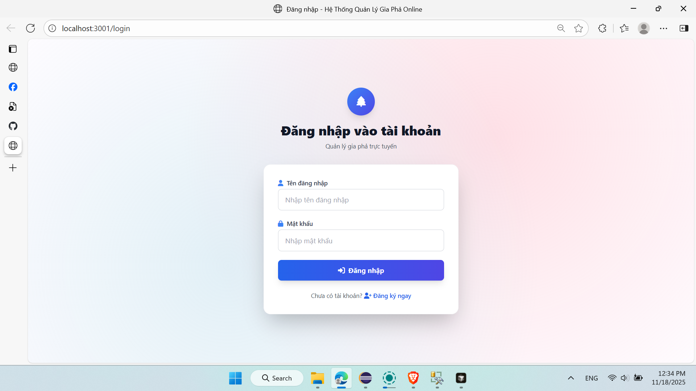
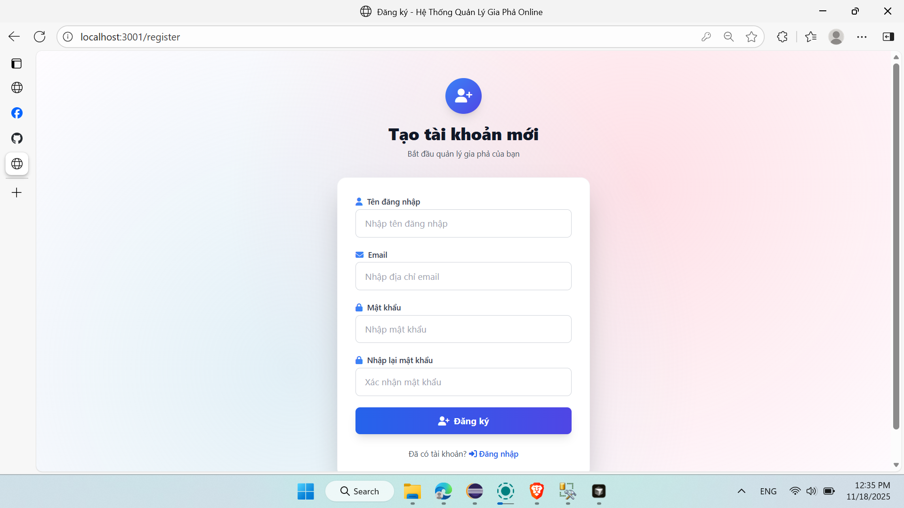
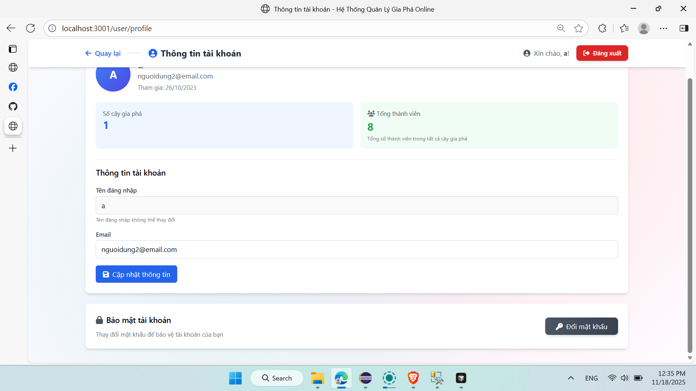

# Hệ Thống Quản Lý Gia Phả Online

Ứng dụng web quản lý cây gia phả trực tuyến với giao diện đẹp và tính năng đầy đủ.

## Tổng quan

Hệ thống cho phép người dùng:
- Tạo và quản lý nhiều cây gia phả
- Thêm/sửa/xóa thành viên
- Quản lý quan hệ (hôn nhân, cha mẹ-con, ruột/nuôi)
- Xem sơ đồ cây gia phả trực quan
- Tìm kiếm thành viên (hỗ trợ tiếng Việt)
- Quản lý người dùng (Admin)
- **Chia sẻ cây gia phả công khai** - Tạo link chia sẻ để người khác xem mà không cần đăng nhập
- **Quản lý hồ sơ người dùng** - Xem và cập nhật thông tin tài khoản, đổi mật khẩu

## Screenshots

### Đăng nhập & Đăng ký



### Quản lý Cây Gia Phả


### Quản lý Thành viên


### Chia sẻ Cây Gia Phả


### Quản lý Hồ sơ



### Admin Dashboard


## Công nghệ

- **Frontend:** Node.js + Express.js (EJS), Tailwind CSS, Vanilla JS
- **Backend:** Node.js + Express.js, Microsoft SQL Server
- **Library:** [Balkan FamilyTree.js](https://balkan.app/FamilyTreeJS)

## Cấu trúc thư mục

```
CayGiaPha/
├── frontend/                    # Frontend application
│   ├── controllers/            # Controllers
│   ├── views/                  # EJS templates
│   │   ├── auth/              # Đăng nhập/đăng ký
│   │   ├── tree/               # Quản lý cây gia phả
│   │   └── admin/              # Admin panel
│   │   ├── user/               # Quản lý hồ sơ người dùng
│   ├── public/                 # Static files
│   │   ├── css/
│   │   └── js/                 # Modular JavaScript files
│   │       ├── config.js       # Cấu hình global
│   │       ├── utils.js        # Utility functions
│   │       ├── api.js          # API client
│   │       ├── auth.js         # Authentication
│   │       ├── tree.js         # Tree management
│   │       ├── member.js       # Member management
│   │       ├── user.js         # User profile
│   │       ├── share.js        # Share functionality
│   │       ├── admin.js        # Admin functions
│   │       └── main.js         # Entry point
│   ├── routes/
│   ├── server.js               # Express server (port 3001)
│   └── package.json
│
├── backend/                    # Backend API server
│   ├── database/
│   │   ├── database.js        # Database layer
│   │   └── api.js             # API routes
│   ├── server.js              # Express server (port 3000)
│   └── package.json
│
└── database/
    ├── CreateDatabase.sql     # SQL script tạo database
    └── AddShareFeature.sql    # SQL script thêm tính năng chia sẻ
```

## Cài đặt và Chạy

### Yêu cầu
- Node.js >= 14.x
- Microsoft SQL Server
- npm

### 1. Clone repository

```bash
git clone https://github.com/XhuyX/CayGiaPha.git
cd CayGiaPha
```

### 2. Cài đặt Database

Chạy các script SQL trong SQL Server Management Studio theo thứ tự:

```bash
# 1. Tạo database và các bảng cơ bản
sqlcmd -S localhost -U sa -P <password> -i database/CreateDatabase.sql

# 2. Thêm tính năng chia sẻ (thêm cột ShareToken và IsPublic)
sqlcmd -S localhost -U sa -P <password> -i database/AddShareFeature.sql
```

### 3. Cấu hình Database

Mở `backend/database/database.js` và cấu hình:

```javascript
const config = {
    server: 'localhost',
    database: 'FamilyTreeDB',
    user: 'sa',
    password: 'your_password',
    options: {
        enableArithAbort: true,
        trustServerCertificate: true
    }
};
```

### 4. Cài đặt Dependencies

```bash
# Backend
cd backend
npm install

# Frontend
cd ../frontend
npm install
```

### 5. Chạy ứng dụng

**Terminal 1 - Backend:**
```bash
cd backend
npm start
```
Backend: `http://localhost:3000`

**Terminal 2 - Frontend:**
```bash
cd frontend
npm start
```
Frontend: `http://localhost:3001`

### 6. Truy cập

Mở trình duyệt: `http://localhost:3001`

## API Endpoints

**Authentication:**
- `POST /api/register` - Đăng ký
- `POST /api/login` - Đăng nhập

**Family Trees:**
- `GET /api/family-trees/:userId` - Danh sách cây
- `POST /api/family-trees` - Tạo cây mới
- `GET /api/family-trees/:treeId` - Chi tiết cây
- `DELETE /api/family-trees/:treeId` - Xóa cây

**Members:**
- `GET /api/members/:memberId` - Chi tiết thành viên
- `POST /api/family-trees/:treeId/members` - Thêm thành viên
- `PUT /api/members/:memberId` - Sửa thành viên
- `DELETE /api/members/:memberId` - Xóa thành viên
- `GET /api/family-trees/:treeId/search?q=name` - Tìm kiếm

**User Profile:**
- `GET /user/profile` - Xem hồ sơ người dùng
- `PUT /api/users/:userId` - Cập nhật thông tin người dùng
- `PUT /api/users/:userId/password` - Đổi mật khẩu

**Share:**
- `GET /share/:token` - Xem cây gia phả công khai (không cần đăng nhập)
- `GET /api/share/:token` - API lấy thông tin cây gia phả công khai
- `POST /api/family-trees/:treeId/share` - Tạo link chia sẻ
- `DELETE /api/family-trees/:treeId/share` - Tắt chia sẻ

**Admin:**
- `GET /api/admin/users` - Danh sách người dùng
- `PUT /api/admin/users/:userId/status` - Khóa/mở khóa

## Tính năng

- Modern UI với Tailwind CSS
- Dreamy Sky Pink Glow theme
- Tìm kiếm thành viên (hỗ trợ tiếng Việt)
- Quản lý quan hệ gia đình
- Tương tác bằng click phải
- Custom modals và dialogs
- Bảo mật với bcrypt
- **Chia sẻ công khai** - Tạo link chia sẻ để người khác xem cây gia phả mà không cần đăng nhập
- **Quản lý hồ sơ** - Xem thống kê, cập nhật thông tin, đổi mật khẩu
- **Kiến trúc modular** - Frontend JavaScript được tách thành các module theo chức năng

## Hướng dẫn sử dụng

1. **Thêm thành viên:** Click phải vào node → Chọn "Add father/mother/wife/son/daughter"
2. **Sửa thông tin:** Click phải → "Sửa"
3. **Xóa thành viên:** Click phải → "Xóa"
4. **Xem chi tiết:** Click phải → "Chi tiết"
5. **Tìm kiếm:** Nhập tên vào search box
6. **Chia sẻ cây gia phả:** Click nút "Chia sẻ" → Tạo link → Copy và chia sẻ
7. **Quản lý hồ sơ:** Click "Thông tin tài khoản" → Xem thống kê, cập nhật thông tin, đổi mật khẩu
8. **Admin:** Vào `/admin` để quản lý người dùng

## Database

**Bảng chính:**
- `NguoiDung` - Tài khoản người dùng
- `DongHo` - Cây gia phả (có thêm cột `ShareToken` và `IsPublic` cho tính năng chia sẻ)
- `ThanhVien` - Thành viên
- `HonNhan` - Quan hệ vợ chồng
- `QuanHeChaMeCon` - Quan hệ cha mẹ-con

**Lưu ý:** Hãy đổi lại mật khẩu trong table `NguoiDung` để đăng nhập (mật khẩu được hash bằng bcrypt)
  
Xem chi tiết: 
- [`database/CreateDatabase.sql`](database/CreateDatabase.sql) - Tạo database và các bảng
- [`database/AddShareFeature.sql`](database/AddShareFeature.sql) - Thêm tính năng chia sẻ
